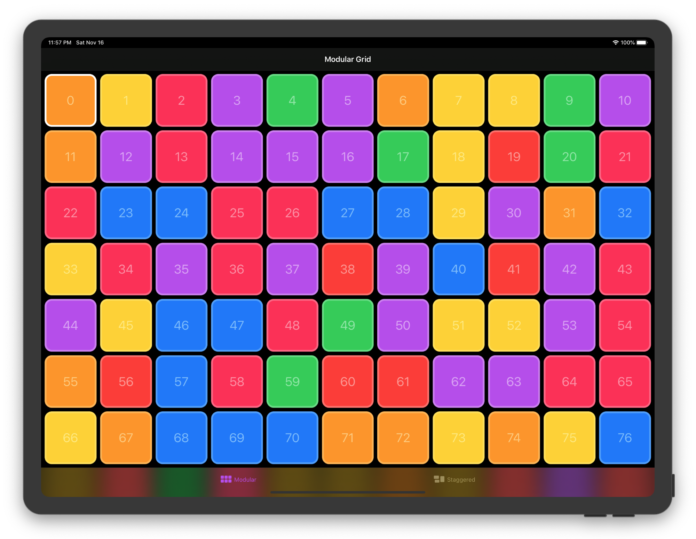

# SwiftUI Grid
SwiftUI Grid view layout with custom styles.

[](https://github.com/spacenation/swiftui-grid/actions)

## Features
- ZStack based layout
- Vertical and horizontal scrolling
- Supports all apple platforms
- Custom styles (ModularGridStyle, StaggeredGridStyle)
- SwiftUI code patterns (StyleStructs, EnvironmentValues, ViewBuilder)
- Active development for production apps

Open `GridDemo.xcodeproj` for more examples for iOS, macOS, watchOS and tvOS

## Styles

### ModularGridStyle (Default)
<center>

</center>

```swift
Grid(colors) {
    Rectangle()
        .foregroundColor($0)
}
.gridStyle(
    ModularGridStyle(columns: .min(100), rows: .min(100))
)
```

### StaggeredGridStyle

<center>

</center>

```swift
Grid(1...69, id: \.self) { index in
    Image("\(index)")
        .resizable()
        .scaledToFit()
}
.gridStyle(
    StaggeredGridStyle(tracks: 8, axis: .horizontal, spacing: 4)
)
```

## Tracks
Tracks setting allows you to customize grid behaviour to your specific use-case. Both Modular and Staggered grid use tracks value to calculate layout. In Modular layout both columns and rows are tracks.

```swift
public enum Tracks: Hashable {
    case count(Int)
    case fixed(CGFloat)
    case min(CGFloat)
}
```

### Count
Grid is split into equal fractions of size provided by a parent view.

```swift
ModularGridStyle(columns: 3, rows: 3)
StaggeredGridStyle(tracks: 8)
```

### Fixed
Item size is fixed to a specific width or height.
```swift
ModularGridStyle(columns: .fixed(100), rows: .fixed(100))
StaggeredGridStyle(tracks: .fixed(100))
```

### Min
Autolayout respecting a min item width or height.
```swift
ModularGridStyle(columns: .min(100), rows: .min(100))
StaggeredGridStyle(tracks: .min(100))
```

## Preferences
Get item size and position with preferences
```swift
struct CardsView: View {
    @State var selection: Int = 0
    
    var body: some View {
        Grid(0..<100) { number in
            Card(title: "\(number)")
                .onTapGesture {
                    self.selection = number
                }
        }
        .padding()
        .overlayPreferenceValue(GridItemBoundsPreferencesKey.self) { preferences in
            RoundedRectangle(cornerRadius: 16)
                .strokeBorder(lineWidth: 4)
                .foregroundColor(.white)
                .frame(
                    width: preferences[self.selection].width,
                    height: preferences[self.selection].height
                )
                .position(
                    x: preferences[self.selection].midX,
                    y: preferences[self.selection].midY
                )
                .animation(.linear)
        }
    }
}
```

## SDKs
- iOS 13+
- Mac Catalyst 13.0+
- macOS 10.15+
- watchOS 6+
- Xcode 11.0+

## Roadmap
- Item rearranging
- 'CSS Grid'-like features

## Code Contributions
Feel free to contribute via fork/pull request to master branch. If you want to request a feature or report a bug please start a new issue.

## Coffee Contributions
If you find this project useful please consider becoming my GitHub sponsor.
