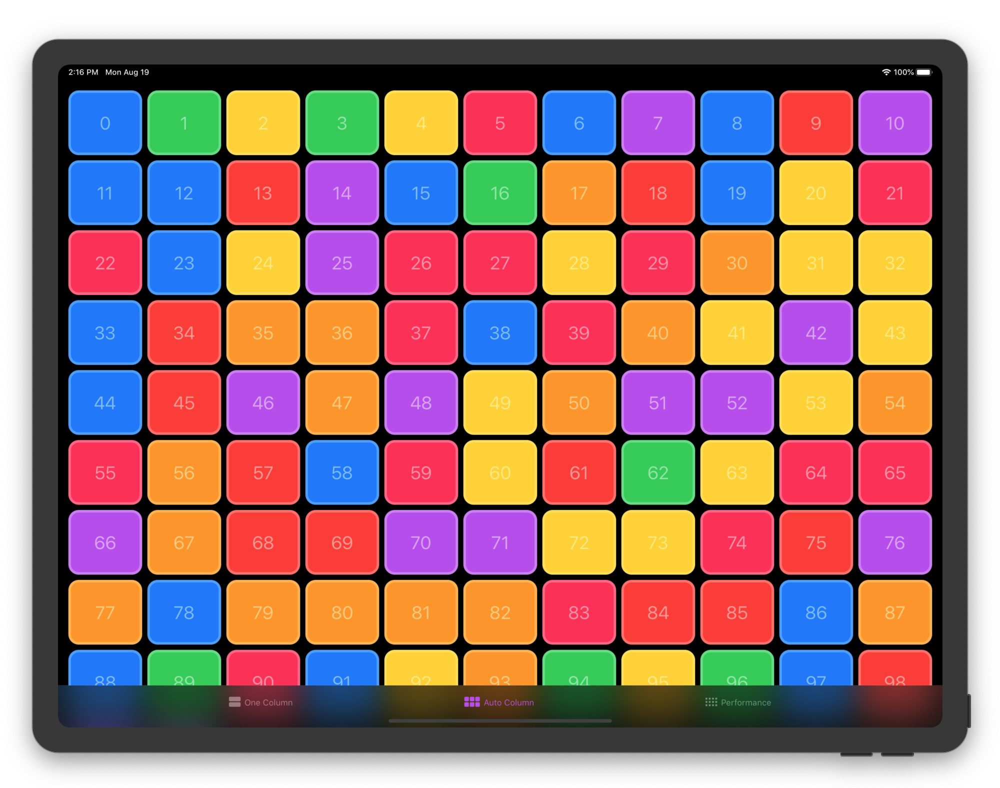
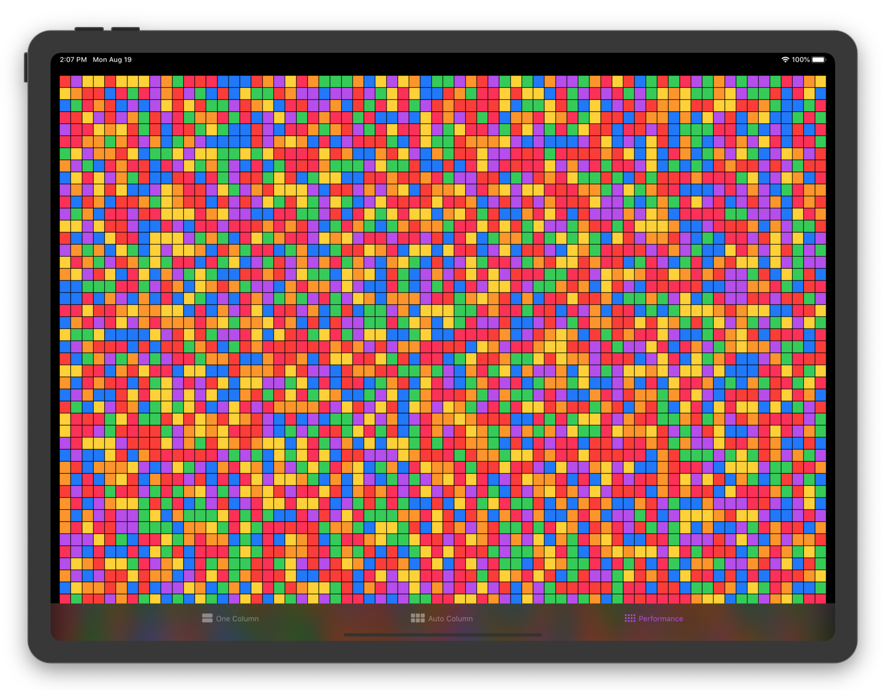

## SwiftUI Grid

SwiftUI Grid view layout with custom styles.

<center>

</center>

## Advantages
- ZStack based layout
- Supports all apple platforms
- Custom Styles (AutoColumns, FixedColumns, SingleColumn)
- SwiftUI code patterns (StyleStructs, EnvironmentValues)
- Active development for production apps

## GridStyles

Open `/Examples/GridExamples.xcodeproj` for more examples for iOS, macOS, watchOS and tvOS


### AutoColumnsGridStyle (Default)

```swift
Grid(0...100) { _ in
    Rectangle()
        .foregroundColor(.blue)
}
```

```swift
Grid {
    ForEach(items, id: \.self) { item in
        Rectangle()
            .foregroundColor(item.color)
    }
}
.padding(.horizontal, 8)
.gridStyle(
    AutoColumnsGridStyle(minItemWidth: 160, itemHeight: 80, hSpacing: 8, vSpacing: 8)
)
```
### FixedColumnsGridStyle

```swift
Grid(0...100) { number in
    Card(title: "\(number)")
}
.gridStyle(
    FixedColumnsGridStyle(columns: 3, itemHeight: 160)
)
```
### SingleColumnGridStyle

```swift
Grid(0...100) { number in
    Card(title: "\(number)")
}
.gridStyle(
    SingleColumnGridStyle(itemHeight: 160)
)
```

## Performance

<center>

</center>

## SDKs
- iOS 13+
- Mac Catalyst 13.0+
- macOS 10.15+
- watchOS 6+
- Xcode 11.0+

## Preferences
Get item size and position with preferences
```swift
struct CardsView: View {
    @State var selection: Int = 0
    
    var body: some View {
        Grid(0..<100) { number in
            Card(title: "\(number)")
                .onTapGesture {
                    self.selection = number
                }
        }
        .padding()
        .overlayPreferenceValue(GridItemPreferences.Key.self) { preferences in
            GeometryReader { geometry in
                RoundedRectangle(cornerRadius: 16)
                    .strokeBorder(lineWidth: 4)
                    .foregroundColor(.white)
                    .frame(
                        width: geometry[preferences[self.selection].bounds].size.width,
                        height: geometry[preferences[self.selection].bounds].size.height
                    )
                    .offset(
                        x: geometry[preferences[self.selection].bounds].minX,
                        y: geometry[preferences[self.selection].bounds].minY
                    )
                    .animation(.spring())
            }
        }
    }
}
```

## Version 1.0.0
Stable version will be released as soon as XCode 11 GM becomes available. We will strictly follow semantic versioning moving forward.

## Roadmap
- Items selection and rearranging
- 'CSS Grid'-like features

## Contibutions
Feel free to contribute via fork/pull request to master branch. If you want to request a feature or report a bug please start a new issue.
